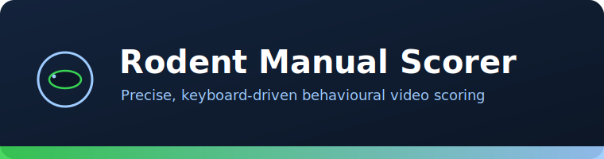
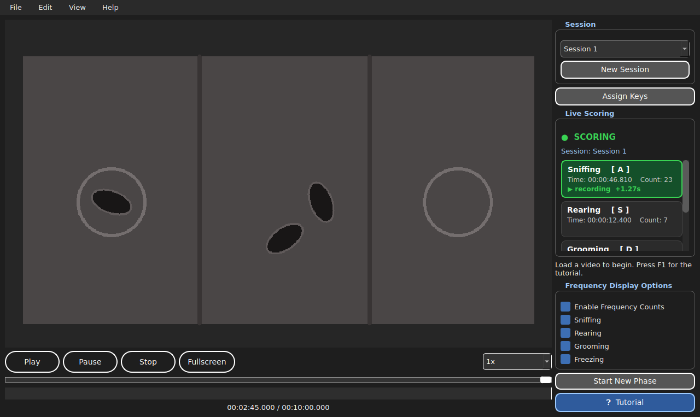

<div align="center">



# Rodent Manual Scorer

A free, open-source desktop tool for fast, precise, manual scoring of behaviour in video recordings.

[](https://www.python.org/)
[](#which-script-should-i-use)
[](LICENSE)
[](https://doi.org/10.1016/j.bbr.2026.116300)
[](https://github.com/diego-mediane/RodentManualScorer/stargazers)

</div>

---

<div align="center">

</div>

---

## Contents

1. [What is it?](#what-is-it)
2. [Features](#features)
3. [Which script should I use?](#which-script-should-i-use)
4. [Installation](#installation)
5. [Quick start](#quick-start)
6. [Keyboard shortcuts](#keyboard-shortcuts)
7. [Output files](#output-files)
8. [Citation](#citation)
9. [Contributing](#contributing)
10. [Licence](#licence)
11. [Acknowledgements](#acknowledgements)
12. [Contact](#contact)

---

## What is it?

Rodent Manual Scorer is a Python desktop application for scoring behaviours in video, in real time. You assign keyboard keys to behaviours (for example `G` for Grooming, `F` for Freezing), play the video, and hold the matching key for as long as each behaviour lasts. The tool records the start time, end time and duration of every event and exports the results to CSV or Excel.

It is built to be simple enough for a first-time user and precise enough for rigorous research.

---

## Features

| | |
|---|---|
| Video playback | Supports `.mp4`, `.avi`, `.mov`, `.mkv`, with drag-and-drop loading |
| Custom key mapping | Bind any key to any behaviour |
| Millisecond timing | Accurate start, end and duration for every event |
| Live scoring panel | The active behaviour lights up while its key is held, with a running on-screen timer |
| Multiple sessions | Score the same video several times; start each pass fresh or continue a copy, and switch between passes without losing any |
| Phases | Split a recording into named phases (for example Baseline, Treatment) shown as coloured bands on the timeline |
| Timeline | All scored events overlaid on a scrubbable progress bar |
| Undo and redo | `Ctrl+Z` and `Ctrl+Y`, with the video rewinding to the affected event |
| Autosave | A recovery CSV is written every five minutes |
| Export | CSV, or an Excel workbook with a Summary sheet and a Detailed events sheet |
| Tooltips and tutorial | Hover any control for an explanation, or press `F1` for a built-in step-by-step guide |

---

## Which script should I use?

| Operating system | Script to run |
|---|---|
| macOS | `VideoTimer.py` |
| Windows | `VideoTimerWindows.py` |

The two scripts are functionally identical. The Windows version adds handling for Windows-specific video backend quirks. The previous release is kept available as `VideoTimer_v1.py` and `VideoTimerWindows_v1.py`.

---

## Installation

Step-by-step guides, written for people who have never used Python before:

- [Installation guide for macOS](INSTALL_MAC.md)
- [Installation guide for Windows](INSTALL_WINDOWS.md)

In short, with Python 3.9 or newer:

```bash
pip install -r requirements.txt
```

---

## Quick start

1. Launch the script for your operating system (see above).
2. Load a video with `File > Load Video`, or drag a file onto the window.
3. Click `Assign Keys` and bind a key to each behaviour.
4. Press `Space` to play, and hold a behaviour key whenever that behaviour occurs.
5. Save with `File > Save Scoring CSV`, or export to Excel.

New to the tool? Open it and press `F1` for the in-app tutorial, or read [TUTORIAL.md](TUTORIAL.md).

---

## Keyboard shortcuts

| Action | Shortcut |
|---|---|
| Play / pause | `Space` |
| Score a behaviour | Hold its assigned key |
| Start a new phase | `P` |
| Undo / redo | `Ctrl+Z` / `Ctrl+Y` |
| Load video | `Ctrl+O` |
| Save CSV / load CSV | `Ctrl+S` / `Ctrl+L` |
| Export Excel | `Ctrl+E` |
| New session | `Ctrl+N` |
| Show time spent | `Ctrl+T` |
| Fullscreen | `F11` |
| Tutorial | `F1` |

---

## Output files

CSV output has one row per event, with columns: `Phase`, `Behaviour`, `Start Time`, `End Time`, `Duration (s)`.

Excel output contains two sheets: a `Summary` sheet with total time and count per behaviour, and a `Detailed_Events` sheet listing every event.

---

## Citation

Citation is required for any published work that uses this software or data produced with it.

If the tool contributed to your analysis, please cite the paper in which it was used:

>Mediane, D. H., Anastasiades, P. G., and Cahill, E. N. (2026). Specific tasks expose constraints on social exploration and ultrasonic vocalisation production in male C57BL/6J mice. *Behavioural Brain Research*, 512, Article 116300. https://doi.org/10.1016/j.bbr.2026.116300

```bibtex
@article{mediane2026,
  author  = {Mediane, Diego Hassan and Anastasiades, Paul G. and Cahill, Emma N.},
  title   = {Specific tasks expose constraints on social exploration and ultrasonic vocalisation production in male C57BL/6J mice},
  journal = {Behavioural Brain Research},
  year    = {2026},
  pages   = {116300},
  doi     = {10.1016/j.bbr.2026.116300},
  url     = {https://doi.org/10.1016/j.bbr.2026.116300}
}
```

You can also cite the software itself via the `Cite this repository` button at the top of this page, which reads from [CITATION.cff](CITATION.cff).

---

## Contributing

Bug reports and feature requests are welcome through the [Issues](https://github.com/diego-mediane/RodentManualScorer/issues) page. See [CONTRIBUTING.md](CONTRIBUTING.md) for details.

---

## Licence

Released under a Non-Commercial Academic Licence. See [LICENSE](LICENSE) for the full terms.

- Free to use, share and modify for academic and non-commercial research
- May not be sold or commercialised
- Citation is required in any published work

---

## Acknowledgements

Developed at the University of Bristol in the Anastasiades Lab and the Cahill Lab.

---

## Contact

For questions, bug reports or feature requests, please open an [Issue](https://github.com/diego-mediane/RodentManualScorer/issues).
